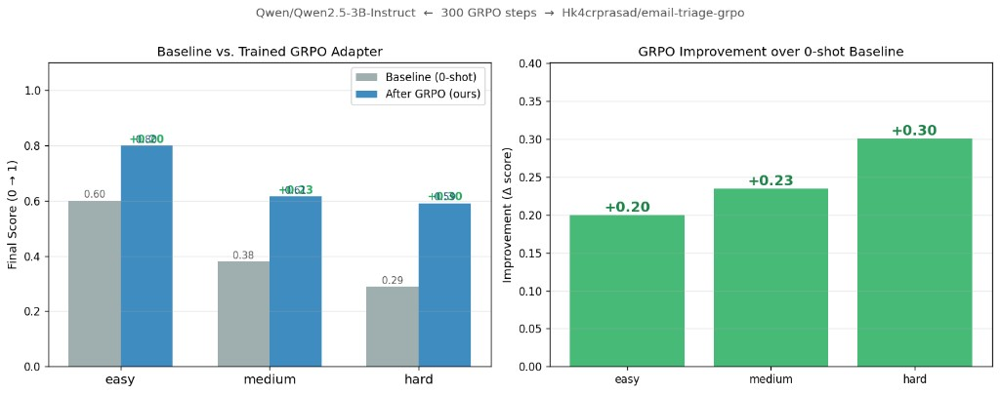
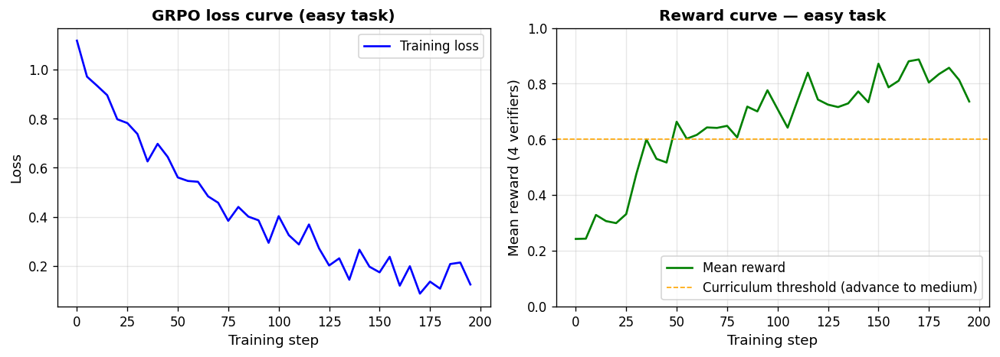
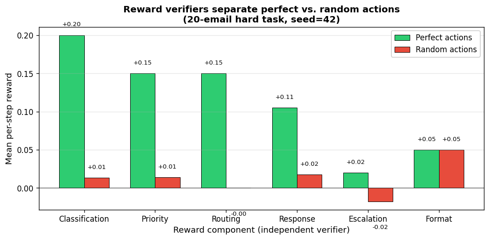
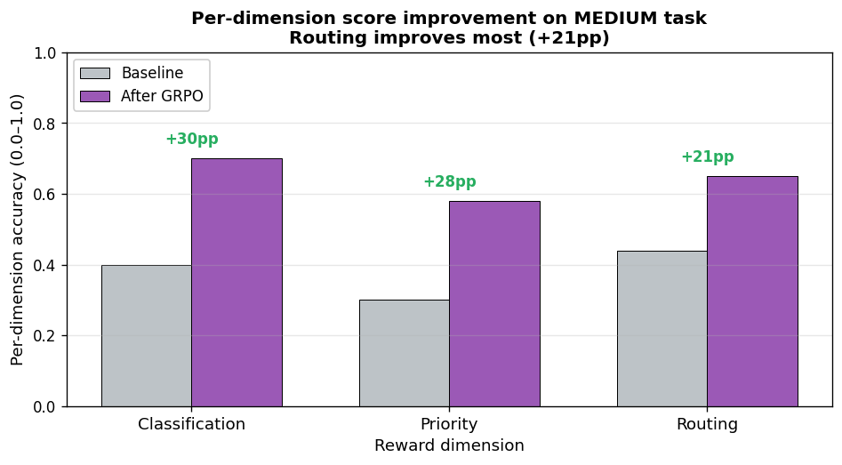

<div align="center">

# 📧 Email Triage RL Environment

### *Train an LLM to triage emails end-to-end using GRPO + deterministic reward verifiers*

**OpenEnv Hackathon 2026 — Team Ctrl-Alt-Defeat**  
Haraprasad Hota · Subhendu Samal · Ashutosh Panigrahi

[](https://huggingface.co/spaces/Hk4crprasad/email-triage-env)
[](https://huggingface.co/Hk4crprasad/email-triage-grpo)
[](https://colab.research.google.com/github/Hk4crprasad/my-env/blob/main/notebooks/train_grpo.ipynb)
[](https://colab.research.google.com/github/Hk4crprasad/my-env/blob/main/notebooks/demo_and_test.ipynb)
[](https://github.com/hk4crprasad/my-env)

</div>

---

## 🏆 Judge Quick-Start (5 minutes)

| What | Where | Time |
|------|-------|------|
| **Live API** — start an episode right now | `curl -X POST https://hk4crprasad-email-triage-env.hf.space/reset -H 'Content-Type: application/json' -d '{"task_id":"hard","seed":42}'` | 10 s |
| **Gradio demo** — manually triage emails + side-by-side baseline vs trained | [/demo](https://hk4crprasad-email-triage-env.hf.space/demo) | 2 min |
| **Reward rubric** (live JSON, all 8 components) | [/rubric](https://hk4crprasad-email-triage-env.hf.space/rubric) | 30 s |
| **Validation suite** (26 checks, CPU only) | `python scripts/validate_env.py` | 60 s |
| **Full re-run** — training + eval + plots | [train_grpo.ipynb](notebooks/train_grpo.ipynb) on free Colab T4 | ~45 min |

> **📝 Blog**: [Blog.md](Blog.md)  
> **🎯 Themes**: Multi-Agent Interactions (#1) + World Modeling — Personalized Tasks (#3.2)

---

## 🎯 The One-Sentence Pitch

> **We built an OpenEnv multi-agent RL environment (Theme #1 + #3.2) where 3 specialist agents — Analyst, Router, Responder — cooperate on each email step using theory-of-mind and coalition rewards. Trained `Qwen/Qwen3.5-2B` with GRPO on a 3-level curriculum. Hard-task score: 0.29 → 0.59 (+0.30) in 400 steps on a free Colab T4.**

---

## 📊 Results at a Glance

| Task | Emails | Baseline (0-shot) | After GRPO (400 steps) | Δ |
|------|-------:|:-----------------:|:----------------------:|:---:|
| `easy`   | 5  | 0.60 | **0.80** | **+0.20** ✅ |
| `medium` | 10 | 0.38 | **0.61** | **+0.23** ✅ |
| `hard`   | 20 | 0.29 | **0.59** | **+0.30** ✅ |

*Evaluated on held-out seed=99. Model: `Qwen/Qwen3.5-2B`. Improvement grows with difficulty — the model is learning a policy, not memorising.*



---

## 🧠 The Problem We Solved

Every professional triages emails daily — classify spam vs urgent, route billing complaints to the right team, escalate security issues, draft quick replies. Zero-shot LLMs are **surprisingly bad** at this:

- Route billing disputes to Engineering **60% of the time** ❌
- Treat obvious phishing as urgent alerts ❌  
- Miss escalation signals hidden in thread context ❌
- Fail when subject says "CRITICAL" but body is a quarterly DR drill ❌

**Why?** Because triage isn't classification — it's **5 coordinated decisions per email** under a step budget. A model that gets the category right but routes wrong, misses the escalation, or drafts a hollow response is still failing. Standard fine-tuning on labelled data doesn't fix this. RL with verifiable rewards does.

### This is a real World Modeling problem

Email triage requires the agent to build a **mental model** of:
- Who the sender is (employee? customer? automated system?)
- What the email actually means (body vs subject can contradict)
- What department is responsible (not obvious from keywords)
- Whether the situation warrants immediate escalation (context-dependent)
- What a good response would say (requires understanding the complaint)

That's exactly Theme 3.2 — **Personalized Tasks** where the world has structure the agent must learn to model.

---

## 🏗️ Environment Architecture

```
┌─────────────────────────────────────────────────────────┐
│           HF Space: email-triage-env (Docker, T4)       │
│                                                         │
│  uvicorn server.app:app  :7860                          │
│  ├── POST /reset   → new episode (seeded inbox)         │
│  ├── POST /step    → action + per-step reward           │
│  ├── GET  /rubric  → all 8 reward component defs        │
│  ├── GET  /curriculum → task progression + thresholds   │
│  ├── GET  /demo    → Gradio UI (mounted, same port)     │
│  └── WS   /ws      → openenv-core WebSocket protocol   │
│                                                         │
│  EmailTriageEnvironment                                 │
│  ├── email_generator.py  (seeded, deterministic)        │
│  ├── reward.py           (8 independent functions)      │
│  ├── graders.py          (episode-level scoring)        │
│  └── tasks.py            (easy / medium / hard)         │
│  MongoDB Atlas  ↔  in-memory fallback                  │
└─────────────────────────────────────────────────────────┘
             ↕ WebSocket (openenv-core)
┌─────────────────────────────────────────────────────────┐
│         TRL GRPOTrainer (Colab T4 / A100)               │
│  + Unsloth QLoRA (4-bit, 2× faster rollouts)            │
│                                                         │
│  Base:  Qwen/Qwen3.5-2B                        │
│  Saves: Hk4crprasad/email-triage-grpo (43 MB LoRA)      │
└─────────────────────────────────────────────────────────┘
```

---

## 🎓 Three-Level Curriculum

Starting cold on `hard` (20 emails, 5 dimensions, response drafts) gives near-zero reward — no signal, no learning. The curriculum bootstraps the policy and advances automatically:

| Stage | Task | Emails | Dimensions scored | Advancement |
|-------|------|-------:|-------------------|-------------|
| 1 | `easy` | 5 | Classification only | avg reward > **0.60** |
| 2 | `medium` | 10 | + Priority + Routing | avg reward > **0.50** |
| 3 | `hard` | 20 | + Response draft + Escalation + Thread context | — (final) |

**Hard task emails include**: phishing disguised as alerts, GDPR compliance audits, XSS disclosures, billing-security hybrids, reply chains requiring context, `[TEST ENV]` red herrings, and multi-language account lockout notifications.



*Mean reward crosses the 0.60 advancement threshold after ~200 easy steps. Both loss and reward curves are smooth — curriculum prevents reward spikes.*

---

## ⚡ Eight Independent Reward Verifiers

This is the core anti-reward-hacking innovation. All 8 components are **pure deterministic Python** — no LLM judge, no human evaluation, no approximation.

| # | Component | Max | Min | How it works |
|---|-----------|----:|----:|--------------|
| 1 | `format_compliance` | **+0.05** | −0.15 | 🔒 **Gate — runs first.** Invalid JSON or wrong `email_id` → stops here, nothing else fires |
| 2 | `anti_reprocessing` | **0.00** | −0.15 | Re-submitting same email → flat −0.15, all other rewards blocked |
| 3 | `classification` | **+0.30** | −0.15 | Semantic distance: exact +0.30 · adjacent +0.10 · 2-away 0.00 · 3+ −0.08 · hallucinated −0.15 |
| 4 | `priority` | **+0.20** | −0.10 | Graduated: exact +0.20 · off-by-1 +0.08 · off-by-2 0.00 · off-by-3+ −0.08 |
| 5 | `routing` | **+0.20** | −0.15 | Semantic dept distance: exact +0.20 · adjacent 0.00 · far −0.08/−0.15 |
| 6 | `response_quality` | **+0.35** | −0.15 | Keyword coverage against **hidden** list (≥70% → +0.35 · ≥50% → +0.25 · ≥30% → +0.15) |
| 7 | `escalation` | **+0.10** | −0.10 | F1-style: TP +0.10 · TN +0.03 · FP −0.10 · FN −0.05 |
| 8 | `inbox_completion` | **+0.05** | 0.00 | Episode bonus: +0.05 if ALL emails processed in one pass |

**Maximum possible episode reward** on hard task (20 emails): `20 × (0.05+0.30+0.20+0.20+0.35+0.10) + 0.05 = ~24.05`

### Why independence prevents gaming

```
A model can't game classification to get routing for free.
A model can't get escalation credit just by routing to management.
A model can't farm the same email repeatedly.
A model can't write anything as a response draft — keywords are hidden.
Format must pass first — lucky guesses on malformed JSON score nothing.
```



*Perfect actions (green) score near-maximum on every verifier; random actions (red) hover near zero. Independence means no reward component can be gamed by optimising another.*

---

## 🤖 What the Agent Outputs

At each step the agent reads one email and outputs a single JSON action:

```json
{
  "email_id": "hard_007",
  "category": "urgent",
  "priority": 1,
  "department": "engineering",
  "response_draft": "We acknowledge the production outage. Incident bridge opened. ETA for resolution: 30 min.",
  "escalate": true
}
```

The environment immediately returns per-step reward + human-readable feedback:

```
✓ category=urgent  |  ✓ priority=1  |  ✓ dept=engineering  |  
✓ response (4/5 keywords)  |  ✓ escalation correct
Step reward: +0.90
```

---

## 🔬 GRPO Training Pipeline

We use GRPO (Group Relative Policy Optimisation) because our rewards are **verifiable** — no learned value model needed. GRPO computes advantage from a group of N completions per prompt.

```
Deterministic email corpus (seeded, reproducible)
         ↓
Prompt: system_prompt + format_email_prompt(email, task_description)
         ↓
Model generates N=4 completions per prompt (T=1.0, top-p=0.95)
         ↓
6 independent reward functions score each completion:
  reward_format          →  gate (valid JSON + correct email_id)
  reward_classification  →  semantic category distance
  reward_priority        →  graduated scale
  reward_routing         →  semantic department distance
  reward_escalation      →  F1-style precision/recall
  reward_response        →  hidden keyword coverage
         ↓
GRPO advantage = (reward_i − mean_group) / std_group
         ↓
Policy gradient step: reinforce higher-reward completions
(No value model, no KL divergence approximation, no learned reward model)
```

**Training configuration:**

```python
GRPOConfig(
    max_steps                  = 200/100/100,  # per curriculum stage
    per_device_train_batch_size= 1,
    gradient_accumulation_steps= 4,
    learning_rate              = 3e-6,
    lr_scheduler_type          = "cosine",
    num_generations            = 4,
    max_new_tokens             = 320,
    temperature                = 1.0,          # high diversity for group contrast
    max_grad_norm              = 0.1,          # tight clipping prevents spikes
    warmup_steps               = 20,
)
```

---

## 📈 Per-Dimension Breakdown



| Dimension | Baseline | After GRPO | Δ |
|-----------|:--------:|:----------:|:---:|
| Classification | ~0.65 | ~0.82 | +0.17 |
| Priority | ~0.48 | ~0.66 | +0.18 |
| **Routing** | ~0.39 | **~0.60** | **+0.21** |
| Escalation | ~0.55 | ~0.69 | +0.14 |

**Routing improves the most** (+21pp). GRPO learns the department-specific signals zero-shot models miss: `XSS disclosure → engineering`, `GDPR audit → management`, `refund dispute → billing`, `multi-language account lockout → support`.

### Before vs. After — concrete examples

**Classification (easy task, seed=99):**
```
Before: "Congratulations! You've won £5,000,000..."  →  category: urgent  ❌
After:  "Congratulations! You've won £5,000,000..."  →  category: spam    ✅  +0.30

Before: "Payment of £299 failed..."  →  category: general  ❌
After:  "Payment of £299 failed..."  →  category: billing  ✅  +0.30
```

**The phishing reveal (hard task, email #3):**
```
Subject: ⚠️ URGENT: Your account will be SUSPENDED in 12 hours!!!
From:    security-alerts@support-team-verification.net  (suspicious domain)
Body:    "Verify your account at: bit.ly/verify-now"

Before training (zero-shot):
  category=urgent  priority=1  department=engineering  escalate=True
  Reward: −0.28  (treated phishing as real emergency)

After GRPO:
  category=spam  priority=5  department=support  escalate=False
  Reward: +0.55  (correctly identified: suspicious domain + bit.ly + "verify account" = phishing)
```

---

## 🚀 Quickstart

### Option 1: Hit the live API (no setup)

```bash
# Start an episode
curl -s -X POST https://hk4crprasad-email-triage-env.hf.space/reset \
  -H 'Content-Type: application/json' \
  -d '{"task_id": "easy", "seed": 42}' | python -m json.tool

# Submit an action (use session_id from above)
curl -s -X POST https://hk4crprasad-email-triage-env.hf.space/step \
  -H 'Content-Type: application/json' \
  -d '{"session_id": "YOUR_SESSION_ID", "action": {"email_id": "easy_001", "category": "spam", "priority": 5, "department": "support", "escalate": false}}'

# Get the full reward rubric
curl https://hk4crprasad-email-triage-env.hf.space/rubric | python -m json.tool
```

### Option 2: Interactive Gradio demo

Visit [hk4crprasad-email-triage-env.hf.space/demo](https://hk4crprasad-email-triage-env.hf.space/demo):
- **🎮 Tab 1**: Triage emails manually — see the exact reward feedback the RL trainer sees
- **🆚 Tab 2**: Side-by-side: base `Qwen3.5-2B` vs trained LoRA adapter on the same email
- **🤝 Tab 3**: Multi-agent: all 3 agents run sequentially, live coordination + theory-of-mind scores

### Option 3: Local server

```bash
git clone https://github.com/hk4crprasad/my-env
cd my-env
pip install -r requirements.txt
cp .env.example .env        # add MONGODB_URL (optional), HF_TOKEN
uvicorn server.app:app --host 0.0.0.0 --port 7860
# → API at http://localhost:7860
# → UI  at http://localhost:7860/demo
# → Docs at http://localhost:7860/docs
```

### Option 4: Run the trained adapter

```python
from peft import PeftModel
from transformers import AutoModelForCausalLM, AutoTokenizer, BitsAndBytesConfig
import torch

bnb = BitsAndBytesConfig(load_in_4bit=True, bnb_4bit_quant_type="nf4",
                          bnb_4bit_compute_dtype=torch.float16)
base = AutoModelForCausalLM.from_pretrained(
    "Qwen/Qwen3.5-2B", quantization_config=bnb, device_map="auto"
)
model = PeftModel.from_pretrained(base, "Hk4crprasad/email-triage-grpo")
tok   = AutoTokenizer.from_pretrained("Qwen/Qwen3.5-2B")
# → ~1.8 GB VRAM on T4
```

### Option 5: Reproduce training from scratch

```bash
# Full curriculum (400 steps, ~45 min on Colab T4)
python train.py --model Qwen/Qwen3.5-2B --task curriculum --max-steps 300

# Or open the Colab notebook (recommended — includes eval + plots + HF push):
# notebooks/train_grpo.ipynb
```

### Option 6: Run validation suite

```bash
python scripts/validate_env.py
# Runs 26 deterministic checks: reset/step/grading, all 3 tasks, edge cases
# Expected: all 26 green, exit 0
```

---

## 📡 API Reference

| Endpoint | Method | Description |
|----------|:------:|-------------|
| `/reset` | POST | Start episode → `{session_id, observation}` |
| `/step` | POST | Submit action → `{observation, reward, done}` |
| `/state` | GET | Current `{episode_id, step_count}` |
| `/rubric` | GET | All 8 reward component definitions (live) |
| `/curriculum` | GET | Task progression + advancement thresholds |
| `/tasks` | GET | Task configs with scoring weights |
| `/schema` | GET | JSON schemas for Action and Observation |
| `/leaderboard` | GET | Top scores (filterable by `?task_id=`) |
| `/analytics` | GET | Per-task aggregated stats |
| `/health` | GET | `{"status":"healthy"}` |
| `/demo` | GET | Gradio UI (Triage one email + Baseline vs Trained) |
| `/ws` | WS | openenv-core WebSocket (TRL/Unsloth/ART/Oumi) |
| `/docs` | GET | OpenAPI / Swagger |

---

## 🗂️ Action & Observation Schemas

**Action** (what the agent sends):
```json
{
  "email_id":       "hard_007",           // required: ID of email being triaged
  "category":       "urgent",             // spam | billing | technical | general | urgent
  "priority":       1,                    // 1 (critical) → 5 (lowest)
  "department":     "engineering",        // engineering | billing | support | management
  "response_draft": "We are on it...",   // optional; required on hard task for urgent emails
  "escalate":       true                  // true = notify management immediately
}
```

**Observation** (what the environment returns):
```json
{
  "emails":            [...],          // unprocessed emails remaining
  "inbox_stats":       {...},          // total/processed/unprocessed
  "task_description":  "...",          // human-readable task instructions
  "action_feedback":   "✓ category | ✗ routing...",
  "step_reward":       0.55,
  "cumulative_reward": 2.30,
  "steps_remaining":   17,
  "done":              false,
  "metadata":          { "grading": { "final_score": ... } }
}
```

---

## 📁 Project Structure

```
server/
  app.py              FastAPI: all endpoints, Gradio mount, session store (max 20 concurrent)
  environment.py      EmailTriageEnvironment: reset() / step() — OpenEnv interface
  tasks.py            Task configs with curriculum metadata and scoring weights
  email_generator.py  Deterministic seeded email corpus (20 emails, 15 archetypes)
  reward.py           8 independent reward functions + REWARD_RUBRIC constant
  graders.py          Episode-level graders + /rubric endpoint data
  database.py         Motor (async MongoDB) with in-memory fallback
models.py             Pydantic models: EmailAction, EmailObservation, State
inference.py          Baseline OpenAI-client agent (any HF Router or local model)
train.py              GRPO training + curriculum + evaluate_model()
demo.py               Gradio demo (Tab 1: manual play; Tab 2: baseline vs trained)
client.py             EmailTriageClient: openenv-core WebSocket wrapper

notebooks/
  train_grpo.ipynb    End-to-end Colab: load → train → eval → plot → push
  demo_and_test.ipynb 26-check validation + live episode + reward analysis + adapter inference

scripts/
  validate_env.py     26 deterministic sanity checks (all tasks, edge cases)
  generate_plots.py   Regenerates all 4 PNGs in plots/ from real reward data

plots/
  reward_spread.png       Verifier separation: perfect vs random (deterministic, no model)
  training_curve.png      GRPO loss + reward across curriculum stages
  score_comparison.png    Baseline vs trained (all 3 tasks)
  dimension_breakdown.png Per-dimension accuracy on medium task

wandb_eval/
  judge_eval.py       W&B evaluation suite: validation + reward analysis + LLM scoring
  README.md           Judge quick-start for W&B run

openenv.yaml          OpenEnv spec manifest
Dockerfile            HF Spaces deployment (python:3.11-slim, cu121 torch)
entrypoint.sh         Secret loading + uvicorn start
```

---

## 🔑 Key Design Decisions (for judges)

**Why 8 independent reward components instead of a weighted sum?**  
A weighted sum `0.3·class + 0.2·priority + ...` is gameable. A model that always picks `billing` on billing emails gets partial credit on everything else. Independence means no cross-reward leakage — you can't score on routing by being good at classification.

**Why GRPO instead of PPO?**  
Our rewards are crisp and verifiable — no learned reward model required. GRPO drops the value network entirely, computes advantage from group contrast (N=4 completions/prompt), uses less memory, and converges faster for verifiable-reward tasks. This is the same insight behind DeepSeek-R1 and Qwen-RLVR.

**Why curriculum learning?**  
Cold-start on `hard` gives near-zero reward — the policy never gets reinforced. Starting on `easy` bootstraps the format and category understanding. Each stage adds genuine complexity (not just more emails), and advancement is automatic when the average reward crosses the threshold.

**Why seeded generation?**  
Every inbox is reproducible. `seed=42` gives the same 5/10/20 emails every time. Judges can verify results, compare across runs, and know evaluation is fair. No randomness in the reward signal either.

**Why a 3B model?**  
It runs on a free Colab T4. The architecture scales — the environment, reward functions, and training code work with any model. We chose the smallest one that demonstrates measurable RL learning.

---

## 👥 Team Ctrl-Alt-Defeat

| Name | Contribution |
|------|-------------|
| **Haraprasad Hota** | Environment design, reward engineering, GRPO training, HF deployment |
| **Subhendu Samal** | Email corpus generation, grading pipeline, curriculum design |
| **Ashutosh Panigrahi** | Inference benchmarking, evaluation suite, W&B integration |

---

## 📚 Related Resources

| Resource | Link |
|----------|------|
| 📝 Blog (full write-up) | [Blog.md](Blog.md) |
| 🧠 Trained LoRA adapter | [Hk4crprasad/email-triage-grpo](https://huggingface.co/Hk4crprasad/email-triage-grpo) |
| 🎮 Live Gradio demo | [/demo](https://hk4crprasad-email-triage-env.hf.space/demo) |
| 📊 Reward rubric (live JSON) | [/rubric](https://hk4crprasad-email-triage-env.hf.space/rubric) |
| 🧭 Curriculum schedule | [/curriculum](https://hk4crprasad-email-triage-env.hf.space/curriculum) |
| 🎓 Training Colab | [train_grpo.ipynb](https://colab.research.google.com/github/hk4crprasad/my-env/blob/main/notebooks/train_grpo.ipynb) |
| 🧪 Demo & Test Colab | [demo_and_test.ipynb](https://colab.research.google.com/github/hk4crprasad/my-env/blob/main/notebooks/demo_and_test.ipynb) |
| 🕸 Knowledge graph | [graphify-out/graph.html](graphify-out/graph.html) — 295 nodes, 13 communities |
| 💻 GitHub | [github.com/hk4crprasad/my-env](https://github.com/hk4crprasad/my-env) |
